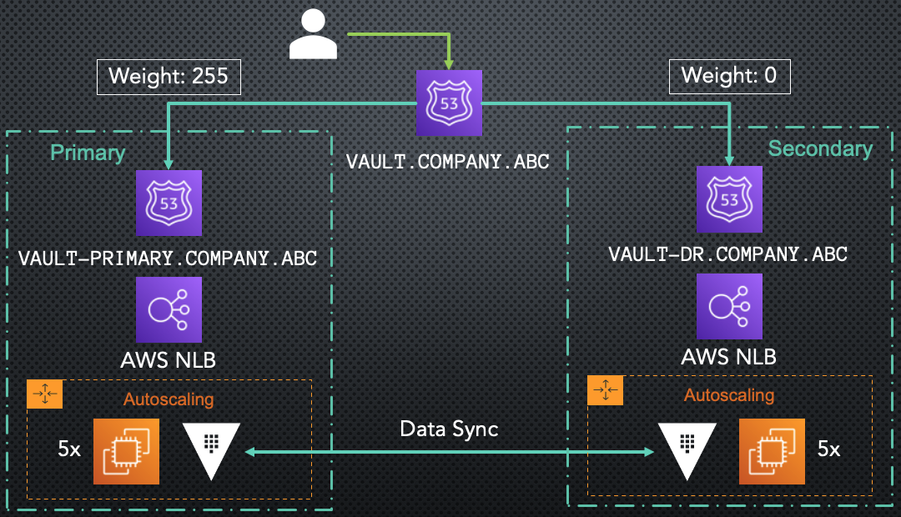

# Terraform Vault Dr

## NOTE

**Terraform repo containing modules for the Presentation and DEMO at HASHICONF EUROPE 2022**

SLIDES: {TO BE INSERTED}

PRESENTATION: {TO BE INSERTED}

## Description

This repo contains the module to deploy 4 AWS lambda functions with their related AWS and Hashicorp Vault resources to make a _sub-minute_ recovery in case of a disaster.

## Pre-requisites

- 2 Vault clusters deployed in AWS with 2 `Route53` records for your hosted zone:

  **HIGH LEVEL ARCHITECTURE:**

  

  Two Vault clusters under autoscaling groups and behind Network Load Balancers with 2 Route53 records, one for the primary cluster and one for the secondary cluster (in DR Replication). Then a higher level endpoint, pointing to both the other two endpoints with a weighted policy; max weight for the primary cluster and minimum weight for the secondary cluster.

- Docker Container Tagged `centos:my-centos` in you Jenkins instance (`Jenkinsfile` line 4). This container can be built from the `jenkins-container` folder (simple `centos` rendition with `python3.8` & `git` installed plus other basic tools).

- Jenkins plugins:

  - CloudBees AWS Credentials https://plugins.jenkins.io/aws-credentials/

    - And AWS credentials in jenkins with id `my-aws-credentials` (`Jenkinsfile` line 27)

  - Pipeline: AWS Steps https://plugins.jenkins.io/pipeline-aws/#documentation (`Jenkinsfile` line 27)

  - Pipeline https://plugins.jenkins.io/workflow-aggregator/

  - Docker Pipeline https://plugins.jenkins.io/docker-workflow/

- Place your `Hashicorp Vault` endpoints into the corresponding variables in `test/example/main.tf` file.

## Local Testing

In order to test the modules locally, first, build the container:

```bash
cd jenkins-container

docker build -t centos:my-centos .
```

After the build has completed, go back into the root folder and just enter the container mounting the file system:

```bash
cd ..

docker run -it --rm -v $(pwd):/workspace centos:my-centos /bin/bash
```

Once inside the container, export the necessary variables (like the AWS credentials), enter the `workspace` directory and issue a `make install-dependencies` command:

```bash
export AWS_ACCESS_KEY_ID=.....
export AWS_SECRET_ACCESS_KEY=....

cd workspace

make install-dependencies
```

This command will install `terraform`, `go` and `nodejs`.

After that, grab a Vault Token and issue:

```bash
VAULT_TOKEN=s.123451234 make test/all
```

## Test Structure

The tests are placed in `test` folder, in particular, there is a single `main_test.go` file which consume the `test/example` folder which itself consume the `terraform/` module.

The go script simply deploy the lambda functions and the Vault resources (everything is in the `terraform/` module) and then destroy everything.

Clearly more comprehensive tests

## CI

The continuous integration is done through Jenkins. The step are simply:

- Insert Vault Token
- Install Dependencies
- Run tests

## CD

Continuous delivery/deploy is not implemented.

Simple integration would be: Adding a stage in the Jenkinsfile that will be triggered only upon a merge onto master branch and tagging the commit with the next version following `semantic versioning`.
